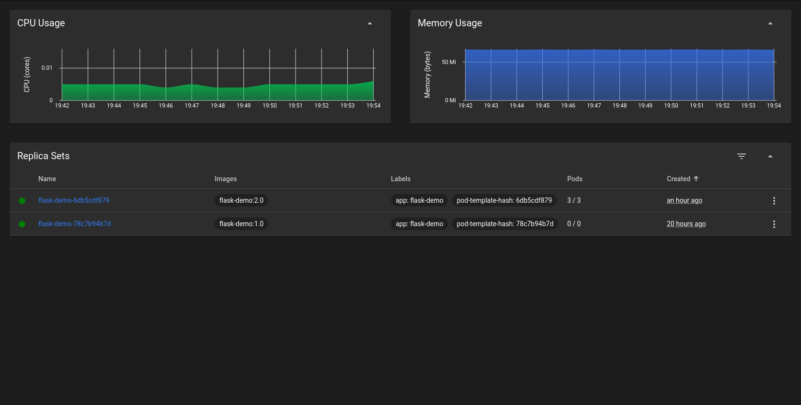
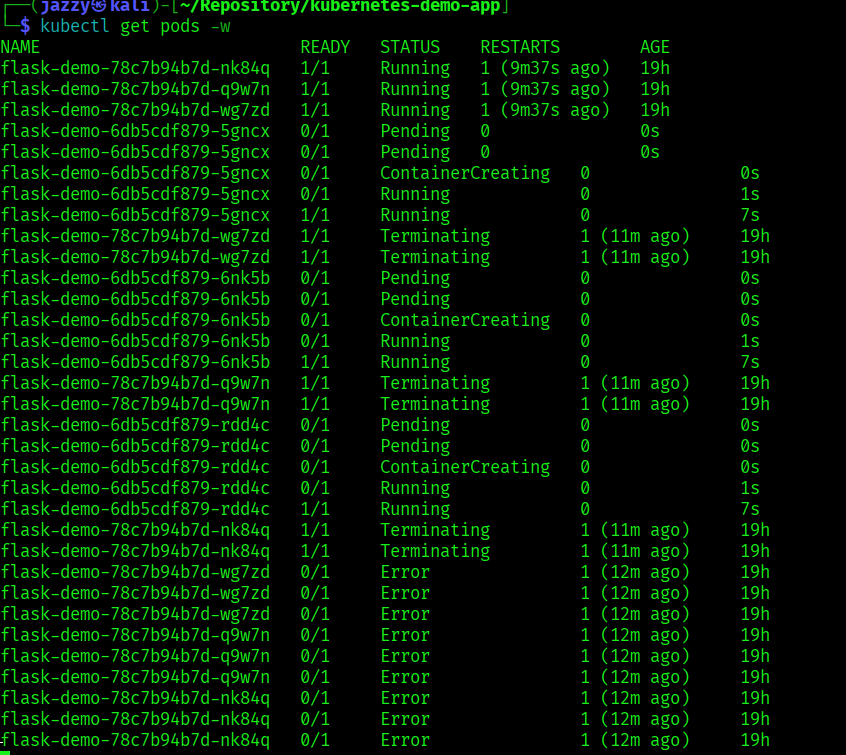
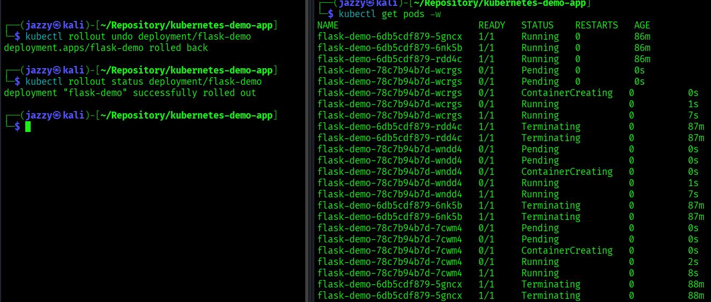

# Kubernetes Self-Healing Demo

Small demo project showing core Kubernetes concepts.

## Stack

- Flask web application
- Docker container
- Kubernetes deployment
- Minikube local cluster

## Architecture

User -> Kubernetes Service -> Pods -> Flask container

The service distributes traffic across multiple pods.
If a pod dies, Kubernetes automatically recreates it.

## Run locally

Start cluster:

        minikube start

Build image inside Minikube:

        eval $(minikube docker-env)
        docker build -t flask-demo:1.0 .

Deploy application:

        kubectl apply -f k8s/deployment.yaml
        kubectl apply -f k8s/service.yaml

Open application:

        minikube service flask-demo-service

## Demonstrate Self-Healing

List pods:

        kubectl get pods

Delete one pod:

        kubectl delete pod
        
Kubernetes automatically creates a new one to maintain the desired state.

## Health Checks

The deployment uses:

- Liveness probe
- Readiness probe

Endpoint used for both:

        /health

## Rolling Updates

Kubernetes updating applications without downtime.

Building new image version:

        eval $(minikube docker-env)
        docker build -t flask-demo2.0 .

Update the running deployment:

        kubectl set image deployment/flask-demo flask-demo=flask-demo2.0

Watch the rollout:

        kubectl get pods -w

Kubernetes gradually replaces old pods with new ones while the service stays available.

     Content shown on website:   Hello from Pod: flask-demo-6db5cdf879-rdd4c - v2 

## Rollback

If a deployment fails, KUbernetes can revert to the previous version:

        kubectl rollout undo deployment/flask-demo

Check rollout status:

